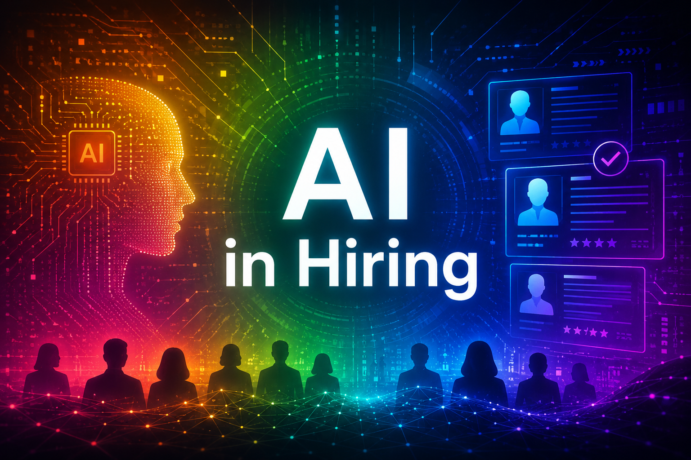

<h2 align="center">Promoting Student Success in the AI Job Market</h2>

  
   
  <em><small>Note: Image generated via DALL-E, 7/22/26.</small></em>

*AI in Hiring: Promoting Student Success in the AI Job Market*, funded by the NC State University Foundation, is aimed at helping students understand how AI is used in hiring and how to build skills to improve career readiness. 

For more about the AI in Hiring Symposium (October 13), **[click here](https://stevemcd1.github.io/AIinHiring/symposium.html)**.

### Coordinating Committee
- [Steve McDonald](https://stevemcd1.github.io/), Alumni Association Distinguished Graduate Professor of Sociology
- [Huiling Ding](https://huilingding.wordpress.ncsu.edu/), University Faculty Scholar and Professor of English
- [Kelly Laraway](https://careers.dasa.ncsu.edu/people/kelly-laraway/), Director of Employer Relations, Career Development Center
- [Bill Rand](https://poole.ncsu.edu/people/wmrand/), McLaughlin Distinguished Professor of Marketing and Analytics
- [Munindar Singh](https://csc.ncsu.edu/people/mpsingh/), SAS Institute Distinguished Professor of Computer Science
- Kevin Lee, Legal Scholar, NC State University
- Britney Schreiber, PhD Student in Sociology

### Activities to date
During the spring semester, we collected survey data from NCSU undergraduate students. The survey covered a wide range of topics including: 1) general familiarity with and frequent use of AI, 2) use of AI tools as part of job searching, 3) knowledge of and comfort with employers’ use of AI in hiring, 4) perceived benefits and risks of AI use in hiring, and 5) attitudes regarding legal/regulatory approaches to AI in hiring. Preliminary results from the survey were presented at the Ethics and Agentic AI Symposium on May 26 at NC State. Further research is being prepared for publication.  

### Future Activities
- On October 13, 2026, we are bringing national and local experts on AI in hiring to campus for a [public symposium](https://stevemcd1.github.io/AIinHiring/symposium.html) aimed at fostering new and productive conversations about how to best navigate the new challenges associated with the increased use of AI in hiring.
- We will offer a special topics graduate seminar on AI in Hiring in spring 2027. Interested students should contact steve_mcdonald[at]ncsu[dot]edu.  
- We are planning a workshop for students on AI in Hiring during the spring 2027 semester. The workshop will share information about the types of AI tools that have been incorporated into organizational HR practices such as recruitment, screening, and selection of job candidates. Students will also learn about strategies for navigating these tools and ways to engage AI to improve their own job searches.
- Follow up student surveys are being prepared for spring 2027.
- We are developing student learning modules (to be included on the Career Development Center's website) to help students better understand and navigate the new AI hiring landscape. 
