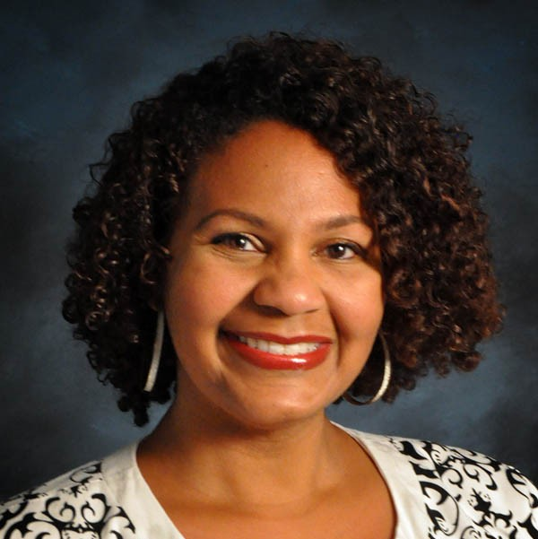
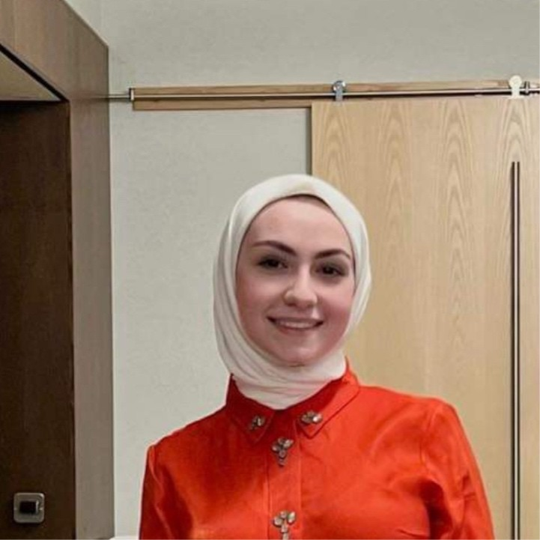
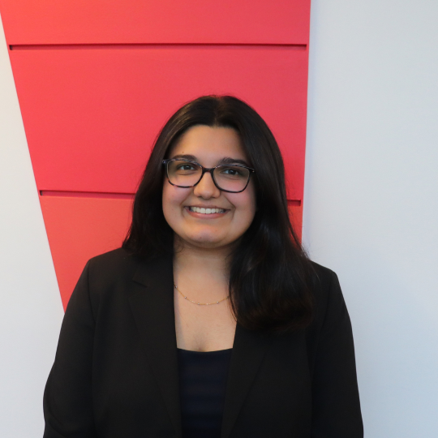
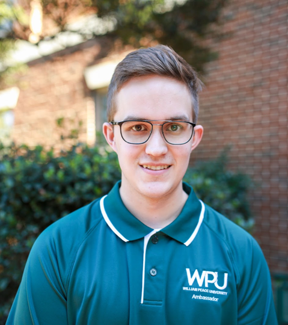
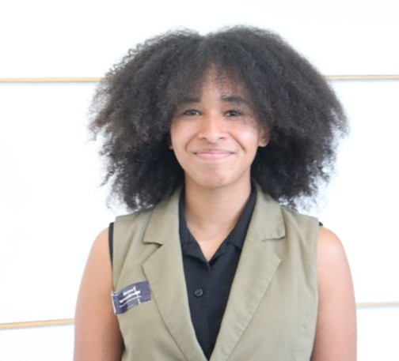

# Keynote Speakers
**[Hilke Schellmann](https://www.hilkeschellmann.com/)**

- Associate Professor
- New York University
- Emmy Award-winning investigative journalist
- Author of The Algorithm
- [more info](https://www.hilkeschellmann.com/)
 

**[Ifeoma Ajunwa](https://ifeomaajunwa.com/)**

- Asa Griggs Chandler Law Professor
- AI and the Future of Work Program Director
- Emory University
- Author of The Quantified Worker
- [more info](https://ifeomaajunwa.com/)
 

# Industry Panelists
**Haroon Abbu**

- Senior VP of Digital Technology, AI, & Data Analytics
- Bell & Howell
- [more info](https://www.linkedin.com/in/haroonabbu/)
 

**Jane Mehringer**

- Global Head
- Talent Attraction at ABB
- [more info](https://www.linkedin.com/in/janemehringer/)
 

**Enrique Lambrano**

- Founder
- Tenzor AI Talent
- [more info](https://www.linkedin.com/in/enrique-lambrano/)
 

**Joey Levene**

- Human Resources Coordinator
- Toshiba Global Commerce Solutions
- [more info](https://www.linkedin.com/in/joeylevene/)
 

# Academic Panelists
**Sandeep Kuttal**

- Associate Professor of Computer Science
- Director of the Human Factors + Experience Engineering Lab
- NC State University
- [more info](https://skuttal.github.io/skk/)
 

**Steve McDonald**

- Distinguished Graduate Professor of Sociology
- University Faculty Scholar
- Director of the AI in Hiring Lab
- NC State University
- [more info](https://stevemcd1.github.io/)
 

**Sonia Gipson Rankin**

 - Interim Associate Dean of Technology and Innovation and Law
 - NC Central University
- [more info](https://www.nccu.edu/employee/sgipsonr)
 

# Student Panelists
**Meriam Ali**

- Electrical and Computer Engineering, Senior
- Career interest: Embedded Systems, AI
- AI & hiring experience: I’ve used AI in my internships and have also been asked to talk about my AI experience in interviews; it’s become an important part of the hiring process
- Uses AI for: Learning new concepts, email and resume refinement, note-taking
- Leadership & Experience: President of Women in ECE, previously interned at Lenovo and John Deere
 

**Sanjana Cheerla**

- Computer Science, PhD
- Career interest: Applied AI, NLP, and building trustworthy AI systems that solve real-world problems - industry oriented.
- AI & hiring experience: experience in developing AI powered tools for industry at AWS/Credit Karma and research. More specifically, fine-tuning models, neuro-symbolic AI, using AI as a judge, chaining models, RAG, and agentic AI.
- Uses AI for: Coding, proofreading, Using AI as a reviewer to strengthen research manuscripts, automation of repetitive tasks, and making presentation slides in LaTeX.
- Leadership & Experience: Computer Science Graduate Student Association President,  PhD researcher in Applied AI and NLP, Teaching Assistant (HCI, ML (ALDA), Software Engineering, and Software Security) , and former 2x AWS Intern and Credit Karma Intern.
 

**Sonali Chhaya**

- Business Analytics, Junior
- Career interest: Business Analytics 
- AI & hiring experience: Knowing how to use AI to automate tasks, proofread, and trouble shoot makes you a more viable candidate. The issue is not doing the work, as more complex AI models are able to solve hard problems, the work lies in understanding how to correct AI solutions with a human touch.
- Uses AI for: Resume refinement, EmaiL/Linkedin message editing, Job description/specification parsing
- Leadership & Experience: Peer Career Coach, Poole Student Ambassador, 180 Degrees Consultant 
 

**Pablo Comino**

- Computer Science, Junior
- Career interest: Cybersecurity / Offensive Security
- AI & hiring experience: AI & Safety in Offensive Security Assessments
- Uses AI for: Building applications, security reviews, vulnerability finding.
- Leadership & Experience: OSCP+ Certified, ISSA President, HackPack VP
 

**Victor Hermida**

- Computer Science, Senior
- Career interest: Software Engineer, Data Science 
- AI & hiring experience: AI is a new thing in technology, and any company will hire you if you know how to use it effectively. 
- Uses AI for: Learning new concepts, Research
- Leadership & Experience: Ex-President of Latino Association of Computer Science, Computer Science Ambassador
 

**Ryan Laraway**

- Business Analytics, Senior at William Peace University
- Career interest: Accounting, Business Analytics, Consulting
- AI & hiring experience: Small Businesses to Large corporations use of AI in hiring
- Uses AI for: Troubleshooting formulas and workflows, automating repetitive tasks, summarizing complex information, improving written and visual deliverables.
- Leadership & Experience: Student Body President, Dealership Accounting and Tax Intern, Small business consultant 
 

**Krys Woodruff**

- Chemical Engineering, 4th year
- Career interest: Sales Engineering, Operations/Supply Chain 
- AI & hiring experience: In a world surrounded by data, learning how to use AI efficiently makes you a better asset to yourself and others
- Uses AI for: Email restructuring/condensing, displaying large chunks of data in dashboards, notes history summary 
- Leadership & Experience: Previously interned at TSMC, Texas Instruments, ExxonMobil
 

# Closing Speaker
**Sarah Heckman**

- Alumni Distinguished Undergraduate Professor of Computer Science
- Acting Executive Director, Data Science and AI Academy
- NC State University
- [more info](https://sheckman.github.io/)
 

# Symposium Organizers
**Steve McDonald**

- Distinguished Graduate Professor of Sociology
- University Faculty Scholar
- Director of the AI in Hiring Lab
- NC State University
- [more info](https://stevemcd1.github.io/)
 

**Kelly Laraway**

- Director of Employer Relations
- Career Development Center
- NC State University
- [more info](https://careers.dasa.ncsu.edu/people/kelly-laraway/)
 

**Bill Rand**

- McLauchlan Distinguished Professor of Marketing and Analytics
- Goodnight Executive Director of the Institute for Advanced Analytics
- NC State University
- [more info](https://analytics.ncsu.edu/people/wmrand/)
 

**Munindar Singh**

- SAS Institute Distinguished Professor of Computer Science
- NC State University
- [more info](https://www.csc2.ncsu.edu/faculty/mpsingh/)
 

**Kevin Lee**

- Executive Director
- Institute for AI and Democratic Governance 
- [more info](https://www.linkedin.com/in/proflee/)
 

**Huiling Ding**

- Professor of Technical Communication
- University Faculty Scholar
- Director of Labor Analytics/Workforce Development, Data Science & AI Academy
- NC State University
- [more info](https://chass.ncsu.edu/people/hding/)
 

**Britney Schreiber**

- Sociology PhD Student
 

