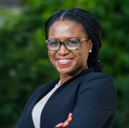
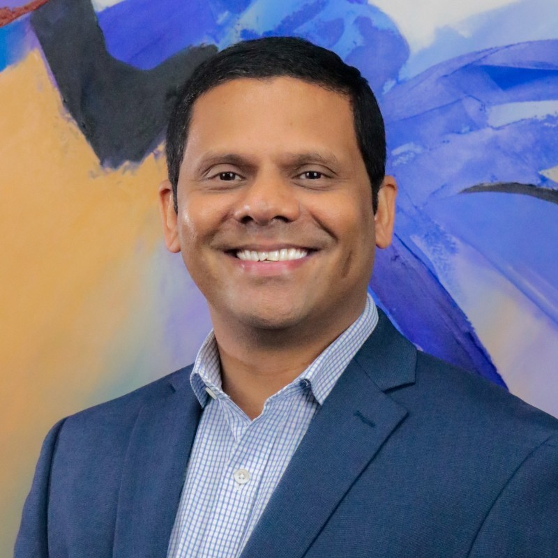
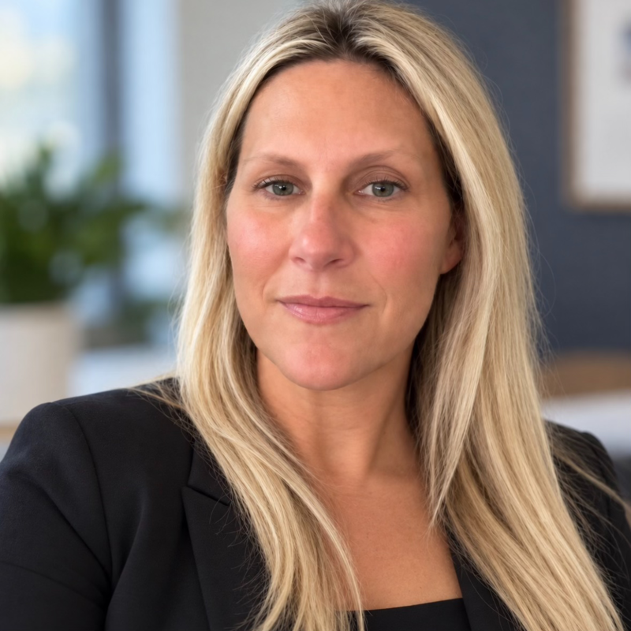
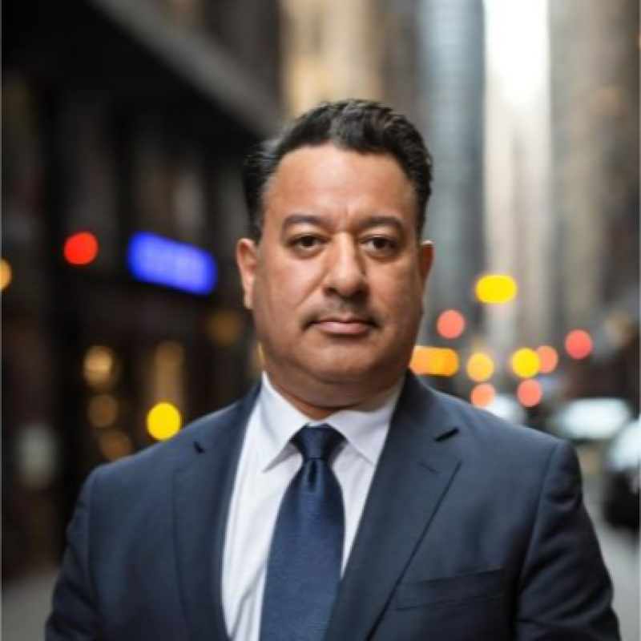
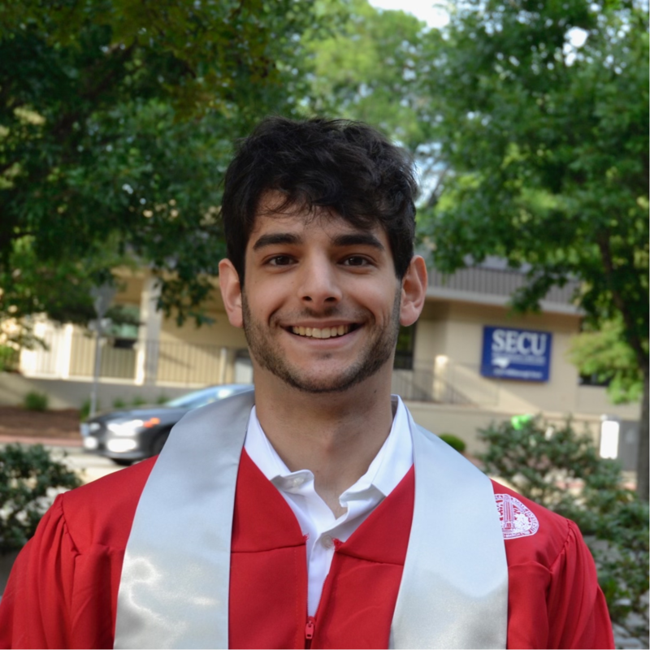
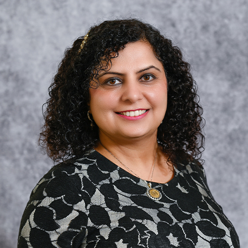
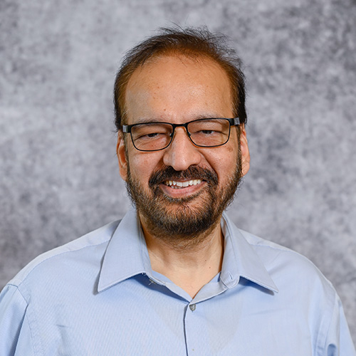
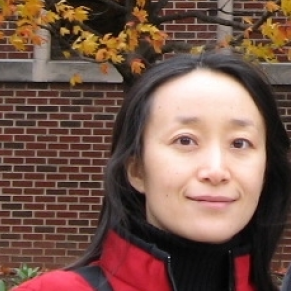

# Keynote Speakers
**Hilke Schellmann**

- Associate Professor
- New York University
 - Emmy Award-winning investigative journalist
 - Author of The Algorithm

**Ifeoma Ajunwa**

 - Asa Griggs Chandler Law Professor
 - AI and the Future of Work Program Director
 - Emory University
 - Author of The Quantified Worker

# Industry Panelists
**Haroon Abbu**

- Senior VP of Digital Technology, AI, & Data Analytics
- Bell & Howell

**Jane Mehringer**

- Global Head
- Talent Attraction at ABB

**Enrique Lambrano**

- Founder
- Tenzor AI Talent

**Joey Levene**

- Human Resources Coordinator
- Toshiba Global Commerce Solutions

# Academic Panelists
**Sandeep Kaur Kuttal**

- Associate Professor of Computer Science
- Director of the Human Factors + Experience Engineering Lab
- NC State University

**Steve McDonald**

- Distinguished Graduate Professor of Sociology
- University Faculty Scholar
- Director of the AI in Hiring Lab
- NC State University

**Sonia Gipson Rankin**

 - Interim Associate Dean of Technology and Innovation and Law
 - NC Central University

# Student Panelists
**Meriam Ali**
- Electrical and Computer Engineering

**Sanjana Cheerla**
- Computer Science

**Sonali Chhaya**
 - Business Analytics

**Pablo Comino**
 - Cybersecurity

**Victor Hermida**
- Computer Science

**Ryan Laraway**
 - Business Analytics

**Krys Woodruff**
 - Chemical Engineering

# Closing Speaker
**Sarah Heckman**

- Alumni Distinguished Undergraduate Professor of Computer Science
- Acting Executive Director, Data Science and AI Academy
- NC State University

# Symposium Organizers
**Steve McDonald**

- Distinguished Graduate Professor of Sociology
- University Faculty Scholar
- Director of the AI in Hiring Lab
- NC State University

**Kelly Laraway**

- Director of Employer Relations
- Career Development Center
- NC State University

**Bill Rand**

- McLauchlan Distinguished Professor of Marketing and Analytics
- Goodnight Executive Director of the Institute for Advanced Analytics
- NC State University

**Munindar Singh**

- SAS Institute Distinguished Professor of Computer Science
- NC State University

**Kevin Lee**

- Executive Director
- Institute for AI and Democratic Governance 

**Huiling Ding**

- Professor of Technical Communication
- University Faculty Scholar
- Director of Labor Analytics/Workforce Development, Data Science & AI Academy
- NC State University

**Britney Schreiber**

- Sociology PhD Student

