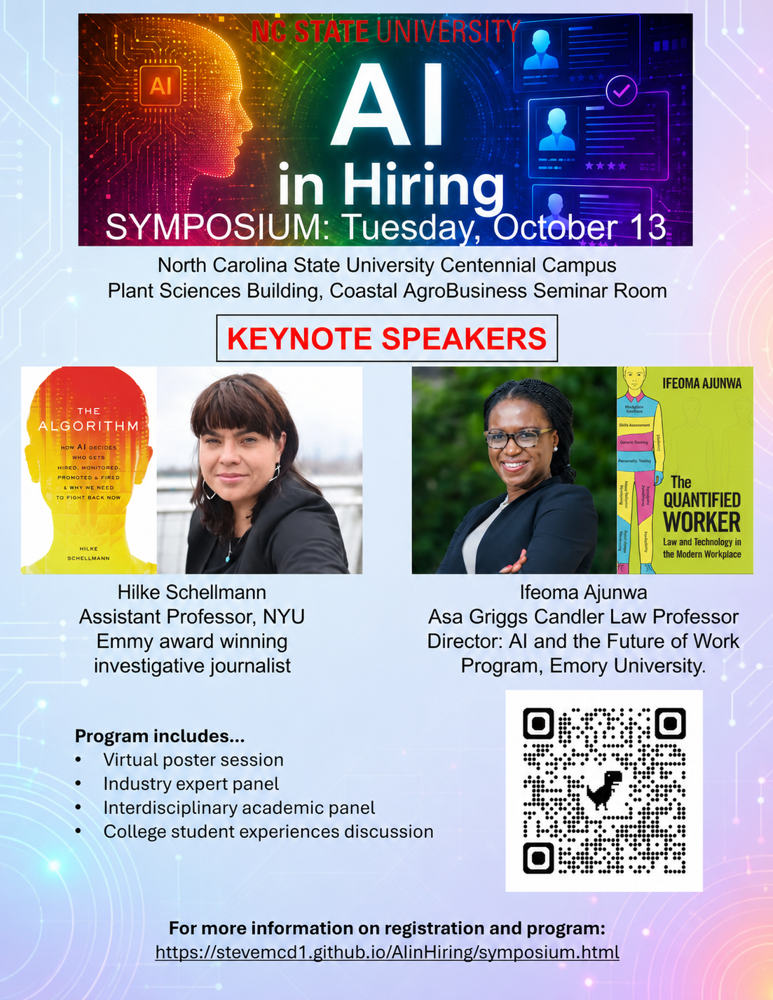

<h2 align="center">AI in Hiring Symposium </h2>

  

*AI in Hiring Symposium*, funded by the NC State University Foundation, is aimed at synthesizing and sharing insights about the increasing use of artificial intelligence in organizational hiring practices and in workers' job search activities. The symposium will provide an opportunity to learn about these important changes from a wide variety of perspectives, including those from academic, legal, and industry experts, as well as student job seekers. 
