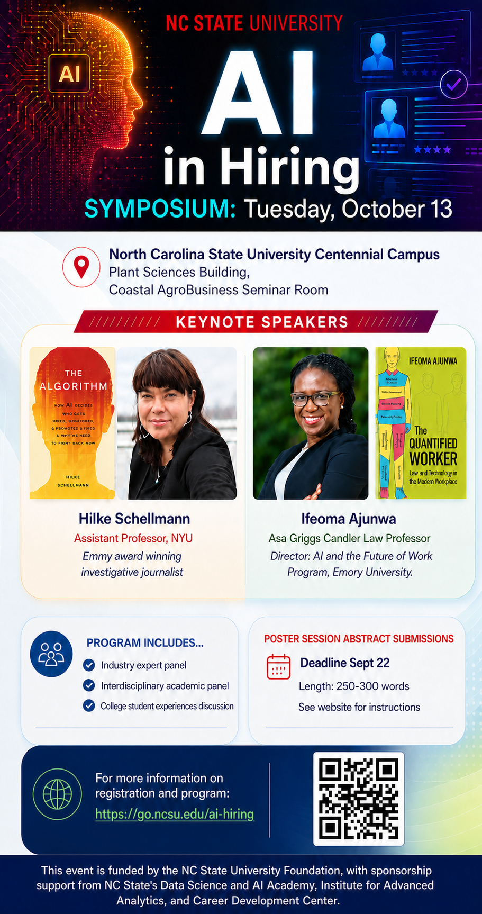

<h2 align="center">AI in Hiring Symposium </h2>

  

*AI in Hiring Symposium* is aimed at synthesizing and sharing insights about the increasing use of artificial intelligence in organizational hiring practices and in workers' job search activities. The symposium will provide an opportunity to learn about these important changes from a wide variety of perspectives, including those from academic, legal, and industry experts, as well as student job seekers. This event is funded by the [NC State University Foundation](https://giving.ncsu.edu/foundation/), with sponsorship support from NC State's [Data Science and AI Academy](https://datascienceacademy.ncsu.edu/), [Institute for Advanced Analytics](https://analytics.ncsu.edu/), and [Career Development Center](https://careers.dasa.ncsu.edu/).  

## Event Registration (free!)
 - [Register for Symposium](https://www.eventbrite.com/e/ai-in-hiring-symposium-tickets-1998118106043?aff=oddtdtcreator)

## Call for Abstracts
The AI in Hiring Symposium invites abstracts for poster presentations addressing the increasing use of artificial intelligence in organizational hiring practices and in workers' job search activities. We welcome work that examines how AI is reshaping recruitment, screening, assessment, and candidate decision-making, along with the legal, ethical, and organizational questions these tools raise. Submissions may come from academic research, legal and policy analysis, industry practice, or the experiences of job seekers themselves. We especially encourage interdisciplinary work and submissions that bring empirical evidence to bear on claims about what these systems do and who they affect. The aim of this symposium is to synthesize insights across these perspectives and clarify what is actually changing in hiring, what is at stake for workers and employers, and what norms, practices, and safeguards the shift may require.

### Abstract Submission Details:
 - Length: 250-400 words
 - Deadline: September 22
 - [Apply to Present a Poster](https://forms.gle/jEex1oWjwHG22u3X6) 

## Preliminary Program
 - 8:30a	Check-in
 - 9:00a	Welcoming remarks 
 - 9:15a	Keynote 1 - Schellmann
 - 10:00a	Q&A 
 - 10:25a	Coffee/snack break
 - 10:35a	Keynote 2 - Ajunwa
 - 11:20a	Q&A
 - 11:45a Poster flash talks
 - noon	  Lunch, posters, & book signing
 - 1:15p	Industry panel 
 - 2:15p	Academic panel 
 - 3:15p	Coffee/snack break
 - 3:30p	Student panel 
 - 4:30p	Closing remarks 
 
Questions? Please email [steve_mcdonald@ncsu.edu](mailto:steve_mcdonald@ncsu.edu) 
