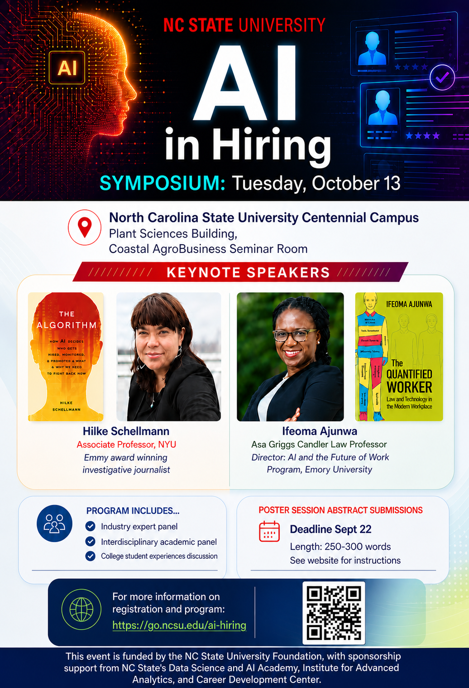

<h2 align="center">AI in Hiring Symposium </h2>

  

*AI in Hiring Symposium* is aimed at synthesizing and sharing insights about the increasing use of artificial intelligence in organizational hiring practices and in workers' job search activities. The symposium will provide an opportunity to learn about these important changes from a wide variety of perspectives, including those from academic, legal, and industry experts, as well as student job seekers. This event is funded by the [NC State University Foundation](https://giving.ncsu.edu/foundation/), with sponsorship support from NC State's [Data Science and AI Academy](https://datascienceacademy.ncsu.edu/), [Institute for Advanced Analytics](https://analytics.ncsu.edu/), and [Career Development Center](https://careers.dasa.ncsu.edu/).  

## Event Registration (free!)
 - [Register for Symposium](https://www.eventbrite.com/e/ai-in-hiring-symposium-tickets-1998118106043?aff=oddtdtcreator)

## Program
[Detailed Program](https://stevemcd1.github.io/AIinHiring/program.html)
*At a glance...*
 - 8:30a	Check-in
 - 9:00a	Welcoming remarks 
 - 9:15a	Keynote 1 - Schellmann
 - 10:30a	Coffee/snack break
 - 10:45a	Keynote 2 - Ajunwa
 - noon	  Lunch & book signing
 - 1:15p	Industry panel 
 - 2:15p	Academic panel 
 - 3:15p	Coffee/snack break
 - 3:30p	Student panel 
 - 4:30p	Closing remarks 
 
Questions? Please email [steve_mcdonald@ncsu.edu](mailto:steve_mcdonald@ncsu.edu) 
