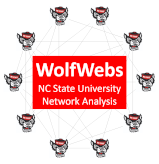

## Social Network Analysis at NC State

[WolfWebs](/WolfWebs/) | [Affiliates](/WolfWebs/affiliates.html) | [Events](/WolfWebs/events.html) | [Coursework](/WolfWebs/coursework.html) 

WolfWebs is an interdisciplinary community of scholars at (or linked to) North Carolina State University who are devoted to the study and teaching of social network analysis (SNA). We engage in an annual speaker series, teach undergraduate and graduate coursework, and participate in informal discussions about SNA. 

If you would like to join WolfWebs or become part of our email list, please email steve_mcdonald (at) ncsu (dot) edu. 
